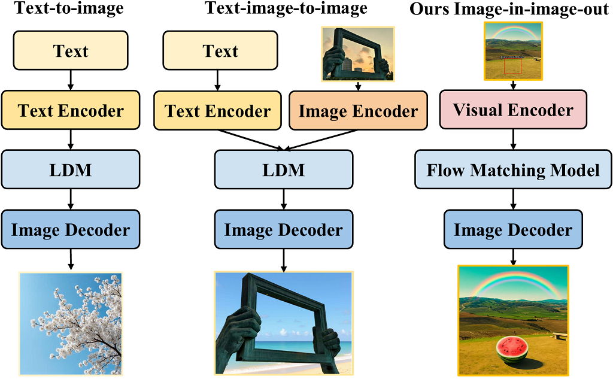
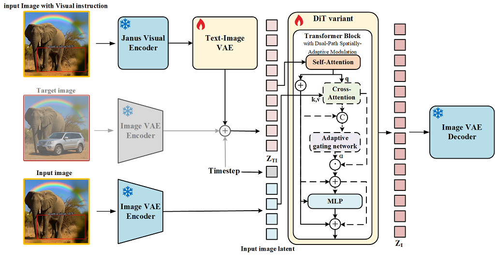
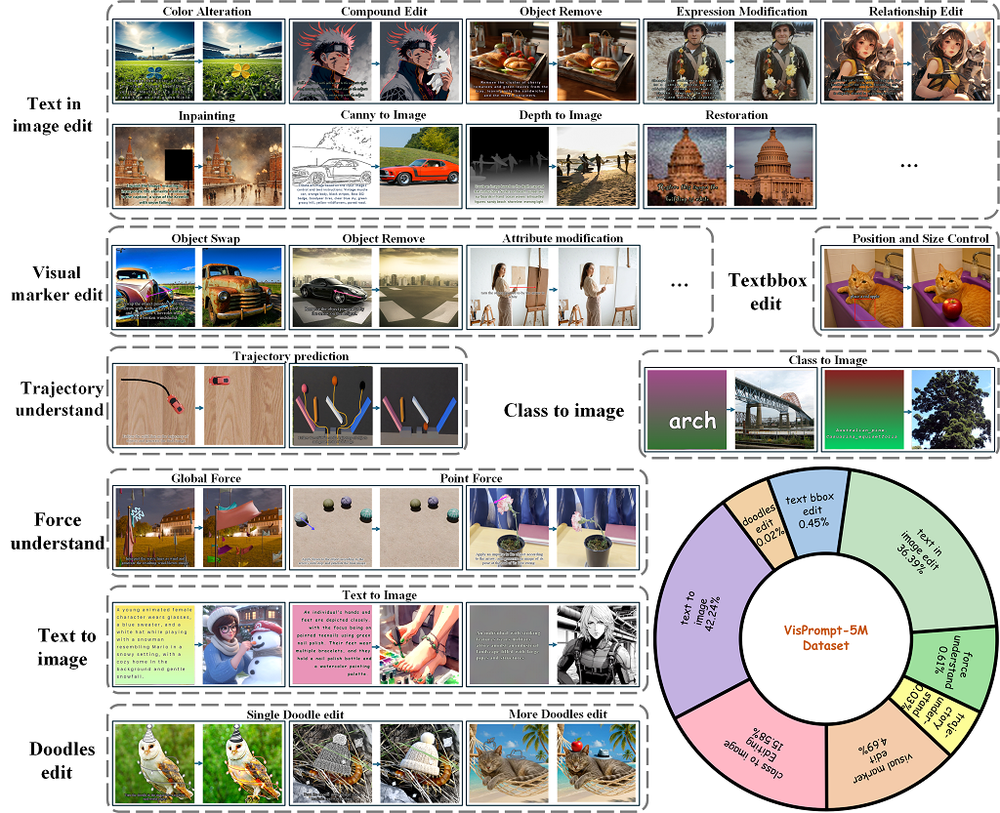

<div align="center">
  
  <h2 align="center" style="margin-top: 0; margin-bottom: 15px;">
    <span style="color:#0052CC">F</span><span style="color:#135FD0">l</span><span style="color:#266CD4">o</span><span style="color:#3979D7">w</span><span style="color:#4C86DB">I</span><span style="color:#6093DF">n</span><span style="color:#73A0E3">O</span><span style="color:#86ADE7">n</span><span style="color:#99BAEB">e</span>: Unifying Multimodal Generation as 
    <span style="color:#0052CC">I</span><span style="color:#0958CE">m</span><span style="color:#125ED0">a</span><span style="color:#1B64D2">g</span><span style="color:#246AD4">e</span><span style="color:#2D70D6">-</span><span style="color:#3676D8">i</span><span style="color:#3F7CDA">n</span><span style="color:#4882DC">,</span>&nbsp;<span style="color:#5188DE">I</span><span style="color:#5A8EE0">m</span><span style="color:#6394E2">a</span><span style="color:#6C9AE4">g</span><span style="color:#75A0E6">e</span><span style="color:#7EA6E8">-</span><span style="color:#87ACEA">o</span><span style="color:#90B2EC">u</span><span style="color:#99B8EE">t</span> Flow Matching
  </h2>
  <p align="center" style="font-size: 15px;">
    <span style="color:#E74C3C; font-weight: bold;">TL;DR:</span> <strong>The first vision-centric image-in, image-out image generation model.</strong>
  </p>

  <p align="center" style="font-size: 14px;">
    <a href="https://github.com/Junc1i">Junchao Yi</a><sup>1*</sup>, <a href="https://ruizhaocv.github.io/">Rui Zhao</a><sup>3*</sup>, <a href="https://github.com/accebet">Jiahao Tang</a><sup>2*</sup>, <a href="https://scholar.google.com/citations?hl=en&user=b2pGch8AAAAJ">Weixian Lei</a><sup>5</sup>, <a href="https://scholar.google.com/citations?user=WR875gYAAAAJ&hl=en">Linjie Li</a><sup>6</sup>, <br>
    <a href="https://github.com/sqs-ustc/">Qisheng Su</a><sup>4</sup>, <a href="https://zyang-ur.github.io/">Zhengyuan Yang</a><sup>6</sup>, <a href="https://www.microsoft.com/en-us/research/people/lijuanw/">Lijuan Wang</a><sup>6</sup>, <a href="https://scholar.google.com/citations?hl=en&user=-bk1CrcAAAAJ">Xiaofeng Zhu</a><sup>1†</sup>, <a href="https://fingerrec.github.io/">Alex Jinpeng Wang</a><sup>2†</sup>
  </p>
  <p align="center" style="font-size: 13px;">
    <sup>1</sup> University of Electronic Science and Technology of China, &nbsp; <sup>2</sup> Central South University <br>
    <sup>3</sup> National University of Singapore, &nbsp; <sup>4</sup> University of Science and Technology of China, &nbsp; <sup>5</sup> Tencent, &nbsp; <sup>6</sup> Microsoft
  </p>
  <p align="center" style="font-size: 16px;">
    <a href="https://csu-jpg.github.io/FlowInOne.github.io/" style="text-decoration: none;">🌐 Homepage</a> | 
    <a href="https://github.com/CSU-JPG/FlowInOne" style="text-decoration: none;">💻 Code</a> | 
    <a href="https://arxiv.org" style="text-decoration: none;">📄 Paper</a> | 
    <a href="https://huggingface.co/datasets/CSU-JPG/VisPrompt5M" style="text-decoration: none;">📁 Dataset</a> | 
    <a href="https://huggingface.co/datasets/CSU-JPG/VPBench" style="text-decoration: none;">🌏 Benchmark</a> | 
    <a href="https://huggingface.co/CSU-JPG/FlowInOne" style="text-decoration: none;">🤗 Model</a>
  </p>
  </div>

## 📢 News

- **[2026-4-8]**: **FlowInOne** has been officially released! 🎉 🎉 🎉

## 📑 Table of Contents

- [🌟 Project Overview](#-project-overview)
- [📊 Dataset Overview](#-dataset-overview)
- [🚀 Setup](#-setup)
- [✨ Inference](#-inference)
- [⏳ Training FlowInOne for I2I](#-training-flowinone-for-i2i)
- [📈 Evaluation](#-evaluation)
- [🎓 BibTex](#-bibtex)
- [📧 Contact](#-contact)
- [🙏 Acknowledgements](#-acknowledgements)

## 🌟 Project Overview

<p align="center">
  
  
</p>

**Fig 1. Overview of the FlowInOne. We unify the conditions as visual input and form a simple image-in, image-out framework with a single model.** 

## 📊 Dataset Overview

<p align="center">
  
</p>

**Fig 2. We construct VisPrompt, a comprehensive dataset that covers wide spectrum of image-to-image generation, ranging from basic text-in-image generation to compositional editing, and further to physics-aware instruction following.**
## 🚀 Setup

- **Environment setup**

**1. Create conda environment**
```
conda create -n flowinone python=3.10 -y
conda activate flowinone
```

**2. Install required packages**

```
git clone git@github.com:CSU-JPG/FlowInOne.git
cd FlowInOne/scripts
sh setup.sh
```

- **Model preparation**
Training the model requires downloading the [Stable Diffusion VAE](https://github.com/CompVis/stable-diffusion), along with the visual encoder of [Janus-Pro-1B](https://huggingface.co/deepseek-ai/Janus-Pro-1B) and other components . For your convenience, all necessary models can be downloaded directly from [here](https://huggingface.co/CSU-JPG/FlowInOne/blob/main/preparation.tar.gz)

## ✨Inference

**1. Download the pretrained checkpoint from Hugging Face** 

```bash
mkdir -p checkpoints
wget -O checkpoints/flowinone_256px.pth https://huggingface.co/CSU-JPG/FlowInOne/resolve/main/flowinone_256px.pth
```

**2. Open `scripts/inference.sh` and directly modify these variables as needed:**

  - `NNET_PATH`: path to the downloaded checkpoint
  - `INPUT_IMAGE`: input image folder (supports both relative and absolute paths)
  - `OUTPUT_IMAGE`: output image folder (supports both relative and absolute paths)
  - `CONFIG_FILE`: config file path
  - `CFG_SCALE`: classifier-free guidance scale (default: `7.0`)
  - `SAMPLE_STEPS`: sampling steps (default: `50`)
  - `SKIP_CROSS_ATTEN`: whether to skip spatially-adaptive gated network and cross attention, if you task is text2image, please set `ture` (`true`/`false`, default: `false`)
  - `BATCH_SIZE`: batch size during inference (default: `1`)

**3. Run inference with the provided script:**

```bash
sh scripts/inference.sh
```

## ⏳Training FlowInOne for I2I

### Training data preparation

You can either:

Download and use our dataset from Hugging Face: [VisPrompt5M](https://huggingface.co/datasets/CSU-JPG/VisPrompt5M), or prepare your own image-pair dataset.

For custom data, organize files with paired `input/` and `output/` folders. 
**Each sample must have a matching relative path/name in `input` and `output`** (extension can be `.png/.jpg/.jpeg`):

```text
your_source_root/
  subset_a/
    input/
      0001.png
      group1/0002.jpg
    output/
      0001.png
      group1/0002.jpg
  subset_b/
    input/
      xxx.jpeg
    output/
      xxx.jpeg
```

Then **pack the dataset into WebDataset tar shards** using `scripts/wds_organize/run_unified_to_tars.sh`:

1. Open `scripts/wds_organize/run_unified_to_tars.sh` and modify:
  - `--root`: your source dataset root (the folder containing paired `input/` and `output/`)
  - `--tar-dir`: output folder for generated tar shards
  - `--samples-per-shard`: number of samples in each tar shard (e.g., `600`)
  - `--key-prefix`: prefix of each sample `__key__` written into tar (e.g., `t2i`)
  - `--data-type`: **only for text-to-image (T2I)** packs, set `t2i` so each sample gets a `type` field; for **any other task**, omit this flag and use the script default (no `type` field written)
  - `--read-workers`: number of worker processes for image reading/packing (larger is faster but uses more CPU/RAM)

When to use `--key-prefix` and `--data-type`:

- `--key-prefix` is useful when you merge multiple tar datasets and want globally distinguishable sample keys (for example, `t2i_`, `c2i_`, `edit_`).
- If you only build one dataset and do not rely on key naming conventions, you can keep the default value.
- `--data-type`: use `**t2i` only** when packing a **text-to-image** dataset. For editing or other tasks, **do not pass** `--data-type` (remove it from `run_unified_to_tars.sh` if present); the default behavior is sufficient.

2. Run:

```bash
sh scripts/wds_organize/run_unified_to_tars.sh
```

After packing, tar shards like `pairs-000000.tar`, `pairs-000001.tar` will be written to `--tar-dir`.

### Data examples

We provide data examples for various I2I tasks. **The I2I dataset is sampled within [VisPrompt5M](https://huggingface.co/datasets/CSU-JPG/VisPrompt5M), and packaged into a tar shard files using the script from the previous section.**

We offer examples in both raw-image folder and tar shard formats. For other data formats, you can use our dataset code as a template and extend it as needed.

1. Download the sample dataset:

```bash
wget -O flowinone_demo_dataset.tar.gz https://huggingface.co/CSU-JPG/FlowInOne/resolve/main/flowinone_demo_dataset.tar.gz
tar -xzvf "flowinone_demo_dataset.tar.gz" -C "/path/to/flowinone_demo_dataset"
```
Hierarchy:

```text
flowinone_demo_dataset/
├── train_tar_pattern/                    # tar shards for training
│   ├── class2image/
│   │   └── pairs-000000.tar
│   ├── doodles_edit/
│   │   └── pairs-000000.tar
│   ├── force_understand/
│   │   └── pairs-000000.tar
│   ├── text_box_edit/
│   │   └── pairs-000000.tar
│   ├── text_in_image_edit/
│   │   └── pairs-000000.tar
│   ├── text2image/
│   │   └── pairs-000000.tar
│   ├── trajectory_understand/
│   │   └── pairs-000000.tar
│   └── visual_marker_edit/
│       └── pairs-000000.tar
├── test_tar_pattern/                     # tar shards for evaluation (usually fewer tar shards)
│   ├── pairs-000000.tar
│
└── vis_imgs/
    ├── input/                            # source/condition images
    └── output/                           # target images; matched with input by filename
```

2. Edit every placeholder in `run_train.sh`: `--train_tar_pattern`, `--test_tar_pattern`, and `--vis_image_root`.

3. (Optional) Extend with your own tar shards to mix extra data.

### Training

**Detailed training instructions are available in [TRAIN.md](TRAIN.md),** including:

- full `run_train.sh` script with inline comments
- all key parameter meanings
- `train_tar_pattern` / `test_tar_pattern` format and multi-source example

Then run:

```bash
bash run_train.sh
```

## 📈 Evaluation

**Evaluates image generation quality on the [VPBench](https://huggingface.co/datasets/CSU-JPG/VPBench) benchmark using a VLM judge** (OpenAI-compatible API: GPT-5.2, etc.).

The benchmark is loaded directly from HuggingFace via `load_dataset`. You only need to provide your model's generated images.

### Usage

**Evaluate all subsets**

```bash
python evaluate_vpbench.py \
    --generated_dir /path/to/your/generated/images \
    --output_dir    ./results \
    --model         gpt-5.2 \
    --api_key       YOUR_OPENAI_API_KEY
```

**Evaluate specific subsets only**

```bash
python evaluate_vpbench.py \
    --generated_dir /path/to/your/generated/images \
    --output_dir    ./results \
    --model         gpt-5.2 \
    --api_key       YOUR_OPENAI_API_KEY \
    --subsets class2image text2image doodles
```

*(You can also use the environment variable `OPENAI_API_KEY` instead of passing `--api_key`)*

### Generated Image Directory Layout

The script recursively searches `generated_dir` for a file whose stem (filename without extension) matches the benchmark image name. Both flat and nested layouts are supported — no subset subfolders required.

**Flat layout (simplest):**

```text
generated/
    img_001.png
    img_002.png
    ...
```

**Nested layout (also fine):**

```text
generated/
    class2image/
        img_001.png
    doodles/
        img_002.png
```

> **NOTE:** Generated images must share the same filename stem as the benchmark source images (case-insensitive, any extension is accepted). Example: benchmark image `cat_001.png` → match `cat_001.jpg` or `cat_001.png`.

## 🎓 BibTex

If you find our work can be helpful, we would appreciate your citation:

```bibtex
@misc{
}
```

## 📧 Contact

Please send emails to **[junchaoyi52@gmail.com](mailto:junchaoyi52@gmail.com)** if there is any question

## 🙏 Acknowledgements

This codebase is built upon the [CrossFlow](https://github.com/qihao067/CrossFlow).We would like to thank for their great work.

## Star History

If you find this project helpful or interesting, a star ⭐ would be greatly appreciated!

[](https://www.star-history.com/#CSU-JPG/FlowInOne&type=date&legend=top-left)
